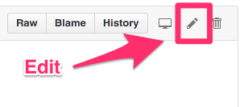

# Docker Cheat Sheet

**想要一起来完善这份速查表吗？参见[贡献手册](#贡献手册contributing)部分吧！**

> 译者注：以下部分链接需科学上网后使用。
> 
> Due to GFW, varies links below could not be accessed in China Mainland.

## 目录

* [为何使用 Docker](#为何使用-docker)
* [系统环境](#系统环境)
* [安装](#安装)
* [容器(Containers)](#容器container)
* [镜像(Images)](#镜像images)
* [网络(Networks)](#网络networks)
* [仓管中心和仓库(Registry & Repository)](#仓管中心和仓库registry--repository)
* [Dockerfile](#dockerfile)
* [层(Layers)](#层layers)
* [链接(Links)](#链接links)
* [卷标(Volumes)](#卷标volumes)
* [暴露端口(Exposing Ports)](#暴露端口exposing-ports)
* [最佳实践](#最佳实践)
* [安全](#安全security)
* [小贴士](#小贴士)
* [贡献手册(Contributing)](#贡献手册contributing)

## 为何使用 Docker

「通过 Docker，开发者可以使用任何语言任何工具创建任何应用。“Dockerized” 的应用是完全可移植的，能在任何地方运行 - 不管是同事的 OS X 和 Windows 笔记本，或是在云端运行的 Ubuntu QA 服务，还是在虚拟机运行的 Red Hat 产品数据中心。

Docker Hub 上有 13000+ 的应用，开发者可以从中选取一个进行快速扩展开发。Docker 跟踪管理变更和依赖关系，让系统管理员能更容易理解开发人员是如何让应用运转起来的。而开发者可以通过 Docker Hub 的共有/私有仓库，构建他们的自动化编译，与其他合作者共享成果。

Docker 帮助开发者更快地构建和发布高质量的应用。」—— [什么是 Docker](https://www.docker.com/what-docker/#copy1)

## 系统环境

我用的是 [Oh My Zsh](https://github.com/robbyrussell/oh-my-zsh) 和 [Docker 插件](https://github.com/robbyrussell/oh-my-zsh/wiki/Plugins#docker)，它可以自动补全 Docker 命令。你的环境可能有所不同。

### Linux

Docker 对于 Linux 内核版本的 [最低要求](https://docs.docker.com/engine/installation/binaries/#check-kernel-dependencies) 为 `3.10.x`。

### MacOS

10.8「Mountain Lion」或更新版本。

### 检查版本

时刻关注你当前正在使用的 Docker 版本是十分重要的，这能够帮助你了解可用的特性。同时，可以让你在查找镜像时选择使用的版本。接下来让我们看看如何操作。

* [`docker version`](https://docs.docker.com/engine/reference/commandline/version/) 查看你正在运行的 Docker 版本。

获取 Docker 服务版本：

```
docker version --format '{{.Server.Version}}'
```

你也可以输出原始的 JSON 数据：

```
docker version --format '{{json .}}'
```

## 安装

### Linux

Docker 官方提供了快速、易用的安装脚本：

```
curl -sSL https://get.docker.com/ | sh
```

如果你不想执行一个不明不白的 Shell 脚本，那么请看 [安装说明](https://docs.docker.com/engine/installation/linux/)，选择你在用的发行版本。

如果你是一个 Docker 超新手，那么你应当先去看看 [系列教程](https://docs.docker.com/engine/getstarted/)。

### macOS

下载并安装 [Docker Community Edition](https://www.docker.com/community-edition)。如果你在使用 Homebrew-Cask，只需在命令行输入 `brew cask install docker` 即可。下载安装 [Docker Toolbox](https://docs.docker.com/toolbox/overview/) 亦可。[Docker For Mac](https://docs.docker.com/docker-for-mac/) 很赞，但是它的安装过程与 VirtualBox 不太一样。详情请查阅 [比较](https://docs.docker.com/docker-for-mac/docker-toolbox/)。

> **注意**：Docker Toolbox 已经过时。你应当使用 Docker Community Edition，详见 [Docker Toolbox](https://docs.docker.com/toolbox/overview/)

安装好 Docker Community Edition 后，点击 Launchpad 内的 Docker 图标。接着即可启动容器了：

```
docker run hello-world
```

好了，现在你有了一个运行中的 Docker 容器了。

## 容器(Container)

[关于 Docker 进程隔离的基础](http://etherealmind.com/basics-docker-containers-hypervisors-coreos/)。容器 (Container) 之于虚拟机 (Virtual Machine) 就好比线程之于进程。或者你可以把他们想成是「吃了类固醇的 chroots」。

### 生命周期

* [`docker create`](https://docs.docker.com/engine/reference/commandline/create) 创建容器但不启动它。
* [`docker rename`](https://docs.docker.com/engine/reference/commandline/rename/) 用于重命名容器。
* [`docker run`](https://docs.docker.com/engine/reference/commandline/run) 一键创建并同时启动该容器。
* [`docker rm`](https://docs.docker.com/engine/reference/commandline/rm) 删除容器。
* [`docker update`](https://docs.docker.com/engine/reference/commandline/update/) 调整容器的资源限制。

通常情况下，不使用任何命令行选项启动一个容器，该容器将会立即启动并停止。若需保持其运行，你可以使用 `docker run -td container_id` 命令。选项 `-t` 表示分配一个 pseudo-TTY 会话，`-d` 表示自动将容器与终端分离（也就是说在后台运行容器，并输出容器 ID）。

如果你需要一个临时容器，可使用 `docker run --rm` 会在容器停止之后删除它。

如果你需要映射宿主机 (host) 的目录到 Docker 容器内，可使用 `docker run -v $HOSTDIR:$DOCKERDIR`。详见 [卷标(Volumes)](#卷标volumes) 一节。

如果你想同时删除与容器相关联的卷标，那么在删除容器的时候必须包含 `-v` 选项，像这样 `docker rm -v`。

从 Docker 1.10 起，其内置一套各容器独立的 [日志引擎](https://docs.docker.com/engine/admin/logging/overview/)，每个容器可以独立使用。你可以使用 `docker run --log-driver=syslog` 来自定义日志引擎（例如以上的 `syslog`）。

### 启动和停止

* [`docker start`](https://docs.docker.com/engine/reference/commandline/start) 启动已存在的容器。
* [`docker stop`](https://docs.docker.com/engine/reference/commandline/stop) 停止运行中的容器。
* [`docker restart`](https://docs.docker.com/engine/reference/commandline/restart) 重启容器。
* [`docker pause`](https://docs.docker.com/engine/reference/commandline/pause/) 暂停运行中的容器，将其「冻结」在当前状态。
* [`docker unpause`](https://docs.docker.com/engine/reference/commandline/unpause/) 结束容器暂停状态。
* [`docker wait`](https://docs.docker.com/engine/reference/commandline/wait) 阻塞地等待某个运行中的容器直到停止。
* [`docker kill`](https://docs.docker.com/engine/reference/commandline/kill) 向运行中的容器发送 SIGKILL 指令。
* [`docker attach`](https://docs.docker.com/engine/reference/commandline/attach) 连接到运行中的容器。

如果你想将容器的端口 (ports) 暴露至宿主机，请见 [暴露端口](#暴露端口exposing-ports) 一节。

关于 Docker 实例崩溃后的重启策略，详见 [本文](http://container42.com/2014/09/30/docker-restart-policies/)。

#### CPU 限制

你可以限制 CPU 资源占用，无论是指定百分比，或是特定核心数。

例如，你可以设置 [`cpu-shares`](https://docs.docker.com/engine/reference/run/#/cpu-share-constraint)。该配置看起来有点奇怪 -- 1024 表示 100% CPU，因此如果你希望容器使用所有 CPU 内核的 50%，应将其设置为 512：

```
docker run -ti --c 512 agileek/cpuset-test
```

更多信息请参阅 <https://goldmann.pl/blog/2014/09/11/resource-management-in-docker/#_cpu>。

通过 [`cpuset-cpus`](https://docs.docker.com/engine/reference/run/#/cpuset-constraint) 可使用特定 CPU 内核。

```
docker run -ti --cpuset-cpus=0,4,6 agileek/cpuset-test
```

请参阅 <https://agileek.github.io/docker/2014/08/06/docker-cpuset/> 获取更多细节以及一些不错的视频。

注意，Docker 在容器内仍然能够 **看到** 全部 CPU -- 它仅仅是不使用全部而已。请参阅 <https://github.com/docker/docker/issues/20770> 获取更多细节。

#### 内存限制

同样，亦可给 Docker 设置 [内存限制](https://docs.docker.com/engine/reference/run/#/user-memory-constraints)：

```
docker run -it -m 300M ubuntu:14.04 /bin/bash
```

#### 能力(Capabilities)

Linux 的 Capability 可以通过使用 `cap-add` 和 `cap-drop` 设置。请参阅 <https://docs.docker.com/engine/reference/run/#/runtime-privilege-and-linux-capabilities> 获取更多细节。这有助于提高安全性。

如需要挂载基于 FUSE 的文件系统，你需要结合 `--cap-add` 和 `--device` 使用：

```
docker run --rm -it --cap-add SYS_ADMIN --device /dev/fuse sshfs
```

授予对某个设备的访问权限：

```
docker run -it --device=/dev/ttyUSB0 debian bash
```

授予对所有设备的访问权限：

```
docker run -it --privileged -v /dev/bus/usb:/dev/bus/usb debian bash
```

有关容器特权的更多信息请参阅 [本文](https://docs.docker.com/engine/reference/run/#/runtime-privilege-and-linux-capabilities)。

### 信息

* [`docker ps`](https://docs.docker.com/engine/reference/commandline/ps) 查看运行中的所有容器。
* [`docker logs`](https://docs.docker.com/engine/reference/commandline/logs) 从容器中读取日志。（你也可以使用自定义日志驱动，不过在 1.10 中，它只支持 `json-file` 和 `journald`）。
* [`docker inspect`](https://docs.docker.com/engine/reference/commandline/inspect) 查看某个容器的所有信息（包括 IP 地址）。
* [`docker events`](https://docs.docker.com/engine/reference/commandline/events) 从容器中获取事件 (events)。
* [`docker port`](https://docs.docker.com/engine/reference/commandline/port) 查看容器的公开端口。
* [`docker top`](https://docs.docker.com/engine/reference/commandline/top) 查看容器中活动进程。
* [`docker stats`](https://docs.docker.com/engine/reference/commandline/stats) 查看容器的资源使用量统计信息。
* [`docker diff`](https://docs.docker.com/engine/reference/commandline/diff) 查看容器文件系统中存在改动的文件。

`docker ps -a` 将显示所有容器，包括运行中和已停止的。

`docker stats --all` 同样将显示所有容器，默认仅显示运行中的容器。

### 导入 / 导出

* [`docker cp`](https://docs.docker.com/engine/reference/commandline/cp) 在容器和本地文件系统之间复制文件或目录。
* [`docker export`](https://docs.docker.com/engine/reference/commandline/export) 将容器的文件系统打包为归档文件流 (tarball archive stream) 并输出至标准输出 (STDOUT)。

### 执行命令

* [`docker exec`](https://docs.docker.com/engine/reference/commandline/exec) 在容器内执行命令。

例如，进入正在运行的 `foo` 容器，并连接 (attach) 到一个新的 Shell 进程：`docker exec -it foo /bin/bash`。

## 镜像(Images)

镜像是 [Docker 容器的模板](https://docs.docker.com/engine/understanding-docker/#how-does-a-docker-image-work)。

### 生命周期

* [`docker images`](https://docs.docker.com/engine/reference/commandline/images) 查看所有镜像。
* [`docker import`](https://docs.docker.com/engine/reference/commandline/import) 从归档文件创建镜像。
* [`docker build`](https://docs.docker.com/engine/reference/commandline/build) 从 Dockerfile 创建镜像。
* [`docker commit`](https://docs.docker.com/engine/reference/commandline/commit) 为容器创建镜像，如果容器正在运行则会临时暂停。
* [`docker rmi`](https://docs.docker.com/engine/reference/commandline/rmi) 删除镜像。
* [`docker load`](https://docs.docker.com/engine/reference/commandline/load) 从标准输入 (STDIN) 加载归档包 (tar archive) 作为镜像，包括镜像本身和标签 (tags, 0.7 起)。
* [`docker save`](https://docs.docker.com/engine/reference/commandline/save) 将镜像打包为归档包，并输出至标准输出 (STDOUT)，包括所有的父层、标签和版本 (parent layers, tags, versions, 0.7 起)。

### 其它信息

* [`docker history`](https://docs.docker.com/engine/reference/commandline/history) 查看镜像的历史记录。
* [`docker tag`](https://docs.docker.com/engine/reference/commandline/tag) 给镜像打标签命名（本地或者仓库均可）。

### 清理

虽然你可以用 `docker rmi` 命令来删除指定的镜像，不过有个名为 [docker-gc](https://github.com/spotify/docker-gc) 的工具，它可以以一种安全的方式，清理掉那些不再被任何容器使用的镜像。Docker 1.13 起，使用 `docker image prune` 亦可删除未使用的镜像。参见 [清理](#清理)。

### 加载 / 保存镜像

从文件中加载镜像：
```
docker load < my_image.tar.gz
```

保存既有镜像：
```
docker save my_image:my_tag | gzip > my_image.tar.gz
```

### 导入 / 导出容器

从文件中导入容器镜像：
```
cat my_container.tar.gz | docker import - my_image:my_tag
```

导出既有容器：
```
docker export my_container | gzip > my_container.tar.gz
```

### 加载已保存的镜像 与 导入已导出为镜像的容器 的不同

通过 `load` 命令来加载镜像，会创建一个新的镜像，并继承原镜像的所有历史。
通过 `import` 将容器作为镜像导入，也会创建一个新的镜像，但并不包含原镜像的历史，因此会比使用 `load` 方式生成的镜像更小。

## 网络(Networks)

Docker 具备 [网络](https://docs.docker.com/engine/userguide/networking/) 功能。我并不是很了解它，所以这是一个扩展本文的好地方。文档 [使用网络](https://docs.docker.com/engine/userguide/networking/work-with-networks/) 指出，这是一种无需暴露端口即可实现 Docker 容器间通信的好方法。

### 生命周期

* [`docker network create`](https://docs.docker.com/engine/reference/commandline/network_create/)
* [`docker network rm`](https://docs.docker.com/engine/reference/commandline/network_rm/)

### 其它信息

* [`docker network ls`](https://docs.docker.com/engine/reference/commandline/network_ls/)
* [`docker network inspect`](https://docs.docker.com/engine/reference/commandline/network_inspect/)

### 建立连接

* [`docker network connect`](https://docs.docker.com/engine/reference/commandline/network_connect/)
* [`docker network disconnect`](https://docs.docker.com/engine/reference/commandline/network_disconnect/)

你可以 [为容器指定 IP 地址](https://blog.jessfraz.com/post/ips-for-all-the-things/)：

```
# 使用你自己的子网和网关创建一个桥接网络
docker network create --subnet 203.0.113.0/24 --gateway 203.0.113.254 iptastic

# 基于以上创建的网络，运行一个 Nginx 容器并指定 IP
$ docker run --rm -it --net iptastic --ip 203.0.113.2 nginx

# 在其他地方使用 CURL 访问这个 IP（假设该 IP 为公网）
$ curl 203.0.113.2
```

## 仓管中心和仓库(Registry & Repository)

仓库 (repository) 是 *被托管(hosted)* 的已命名镜像 (tagged images) 的集合，这组镜像用于构建容器文件系统。

仓管中心 (registry) 则是 *托管服务(host)* -- 用于存储仓库并提供 HTTP API，以便 [管理仓库的上传和下载](https://docs.docker.com/engine/tutorials/dockerrepos/)。

Docker 官方托管着自己的 [仓管中心](https://hub.docker.com/)，包含着数量众多的仓库。不过话虽如此，这个仓管中心 [并没有很好地验证镜像](https://titanous.com/posts/docker-insecurity)，所以如果你担心安全问题的话，请尽量避免使用它。

* [`docker login`](https://docs.docker.com/engine/reference/commandline/login) 登入仓管中心。
* [`docker logout`](https://docs.docker.com/engine/reference/commandline/logout) 登出仓管中心。
* [`docker search`](https://docs.docker.com/engine/reference/commandline/search) 从仓管中心检索镜像。
* [`docker pull`](https://docs.docker.com/engine/reference/commandline/pull) 从仓管中心拉取镜像到本地。
* [`docker push`](https://docs.docker.com/engine/reference/commandline/push) 从本地推送镜像到仓管中心。

### 本地仓管中心

你可以使用 [docker distribution](https://github.com/docker/distribution) 项目搭建本地的仓管中心，详情参阅 [本地发布 (local deploy)](https://github.com/docker/docker.github.io/blob/master/registry/deploying.md) 的介绍。

科学上网后，也可以看看 [Google+ Group](https://groups.google.com/a/dockerproject.org/forum/#!forum/distribution)。

## Dockerfile

当你执行 `docker build` 时，Docker 将会根据 [配置文件](https://docs.docker.com/engine/reference/builder/) 启动 Docker 容器。远优于使用 `docker commit`。

以下是一些编写 Dockerfile 的常用编辑器，并链接到适配的语法高亮模块︰

* 如果你在使用 [jEdit](http://jedit.org)，你可以使用我开发的 Dockerfile [语法高亮模块](https://github.com/wsargent/jedit-docker-mode)。
* [Sublime Text 2](https://packagecontrol.io/packages/Dockerfile%20Syntax%20Highlighting)
* [Atom](https://atom.io/packages/language-docker)
* [Vim](https://github.com/ekalinin/Dockerfile.vim)
* [Emacs](https://github.com/spotify/dockerfile-mode)
* [TextMate](https://github.com/docker/docker/tree/master/contrib/syntax/textmate)
* 更多信息请参阅 [Docker 遇上 IDE](https://domeide.github.io/)

### 指令

* [.dockerignore](https://docs.docker.com/engine/reference/builder/#dockerignore-file)
* [FROM](https://docs.docker.com/engine/reference/builder/#from) 为其他指令设置基础镜像 (Base Image)。
* [MAINTAINER (deprecated - use LABEL instead)](https://docs.docker.com/engine/reference/builder/#maintainer-deprecated) 为生成的镜像设置作者字段。
* [RUN](https://docs.docker.com/engine/reference/builder/#run) 在当前镜像的基础上生成一个新层并执行命令。
* [CMD](https://docs.docker.com/engine/reference/builder/#cmd) 设置容器默认执行命令。
* [EXPOSE](https://docs.docker.com/engine/reference/builder/#expose) 告知 Docker 容器在运行时所要监听的网络端口。注意：并没有实际上将端口设置为可访问。
* [ENV](https://docs.docker.com/engine/reference/builder/#env) 设置环境变量。
* [ADD](https://docs.docker.com/engine/reference/builder/#add) 将文件、目录或远程文件复制到容器中。缓存无效。请尽量用 `COPY` 代替 `ADD`。
* [COPY](https://docs.docker.com/engine/reference/builder/#copy) 将文件或文件夹复制到容器中。注意：将使用 ROOT 用户复制文件，故无论 USER / WORKDIR 指令如何配置，你都需要手动修改其所有者（`chown`），`ADD` 也是一样。
* [ENTRYPOINT](https://docs.docker.com/engine/reference/builder/#entrypoint) 将容器设为可执行的。
* [VOLUME](https://docs.docker.com/engine/reference/builder/#volume) 在容器内部创建挂载点 (mount point) 指向外部挂载的卷标或其他容器。
* [USER](https://docs.docker.com/engine/reference/builder/#user) 设置随后执行 RUN / CMD / ENTRYPOINT 命令的用户名。
* [WORKDIR](https://docs.docker.com/engine/reference/builder/#workdir) 设置工作目录 (working directory)。
* [ARG](https://docs.docker.com/engine/reference/builder/#arg) 定义编译时 (build-time) 变量。
* [ONBUILD](https://docs.docker.com/engine/reference/builder/#onbuild) 添加触发指令，当该镜像被作为其他镜像的基础镜像时该指令会被触发。
* [STOPSIGNAL](https://docs.docker.com/engine/reference/builder/#stopsignal) 设置停止容器时，向容器内发送的系统调用信号 (system call signal)。
* [LABEL](https://docs.docker.com/config/labels-custom-metadata/) 将键值对元数据 (key/value metadata) 应用到镜像、容器或是守护进程。

### 教程

* [Flux7's Dockerfile Tutorial](http://flux7.com/blogs/docker/docker-tutorial-series-part-3-automation-is-the-word-using-dockerfile/)

### 例子

* [Examples](https://docs.docker.com/engine/reference/builder/#dockerfile-examples)
* [Best practices for writing Dockerfiles](https://docs.docker.com/engine/userguide/eng-image/dockerfile_best-practices/)
* [Michael Crosby](http://crosbymichael.com/) 还有更多的 [Dockerfiles best practices](http://crosbymichael.com/dockerfile-best-practices.html) / [take 2](http://crosbymichael.com/dockerfile-best-practices-take-2.html)
* [Building Good Docker Images](http://jonathan.bergknoff.com/journal/building-good-docker-images) / [Building Better Docker Images](http://jonathan.bergknoff.com/journal/building-better-docker-images)
* [Managing Container Configuration with Metadata](https://speakerdeck.com/garethr/managing-container-configuration-with-metadata)

## 层(Layers)

Docker 的版本化文件系统是基于层的。就像 [Git 的提交或文件变更系统](https://docs.docker.com/engine/userguide/storagedriver/imagesandcontainers/) 一样。

## 链接(Links)

链接 (links) [通过 TCP/IP 端口](https://docs.docker.com/userguide/dockerlinks/) 实现 Docker 容器之间的通讯。[Atlassian](https://blogs.atlassian.com/2013/11/docker-all-the-things-at-atlassian-automation-and-wiring/) 展示了可用的例子。你还可以 [通过主机名 (hostname) 链接](https://docs.docker.com/engine/userguide/networking/default_network/dockerlinks/#/updating-the-etchosts-file)。

在某种意义上来说，该特性已经被 [自定义网络](https://docs.docker.com/network/) 所替代。

注意: 如果你希望容器之间**只**通过链接进行通讯，在启动 Docker 守护进程时，请使用 `-icc=false` 来禁用内部进程通讯。

假设你有一个名为 CONTAINER 的容器（通过 `docker run --name CONTAINER` 指定）并且在 Dockerfile 中，暴露了一个端口:

```
EXPOSE 1337
```

然后，我们创建另外一个名为 LINKED 的容器:

```
docker run -d --link CONTAINER:ALIAS --name LINKED user/wordpress
```

然后 CONTAINER 暴露的端口和别名将会以如下的环境变量出现在 LINKED 中:

```
$ALIAS_PORT_1337_TCP_PORT
$ALIAS_PORT_1337_TCP_ADDR
```

那么你便可以通过这种方式来连接它了。

使用 `docker rm --link` 即可删除链接。

通常，Docker 容器（亦可理解为「服务」）之间的链接，是「服务发现」的一个子集。如果你打算在生产中大规模使用 Docker，这将是一个很大的问题。请参阅[The Docker Ecosystem: Service Discovery and Distributed Configuration Stores](https://www.digitalocean.com/community/tutorials/the-docker-ecosystem-service-discovery-and-distributed-configuration-stores) 获取更多信息。

## 卷标(Volumes)

Docker 的卷标 (volumes) 是 [独立的文件系统](https://docs.docker.com/engine/tutorials/dockervolumes/)。它们并非必须连接到特定的容器上。

### 生命周期

* [`docker volume create`](https://docs.docker.com/engine/reference/commandline/volume_create/)
* [`docker volume rm`](https://docs.docker.com/engine/reference/commandline/volume_rm/)

### 信息

* [`docker volume ls`](https://docs.docker.com/engine/reference/commandline/volume_ls/)
* [`docker volume inspect`](https://docs.docker.com/engine/reference/commandline/volume_inspect/)

卷标在不能使用链接（只有 TCP/IP）的情况下非常有用。例如，如果你有两个 Docker 实例需要通讯并在文件系统上留下记录。

你可以一次性将其挂载到多个 docker 容器上，通过 `docker run --volumes-from`。

因为卷标是独立的文件系统，它们通常被用于存储各容器之间的瞬时状态。也就是说，你可以配置一个无状态临时容器，关掉之后，当你有第二个这种临时容器实例的时候，你可以从上一次保存的状态继续执行。

查看 [卷标进阶](http://crosbymichael.com/advanced-docker-volumes.html) 来获取更多细节。[Container42](http://container42.com/2014/11/03/docker-indepth-volumes/) 非常有用。

你可以 [将宿主 MacOS 的文件夹映射为 Docker 卷标](https://docs.docker.com/engine/tutorials/dockervolumes/#mount-a-host-directory-as-a-data-volume)：

```
docker run -v /Users/wsargent/myapp/src:/src
```

你也可以用远程 NFS 卷标，如果你觉得你 [有足够勇气](https://docs.docker.com/engine/tutorials/dockervolumes/#/mount-a-shared-storage-volume-as-a-data-volume)。

还可以考虑运行一个纯数据容器，像 [这里](http://container42.com/2013/12/16/persistent-volumes-with-docker-container-as-volume-pattern/) 所说的那样，提供可移植数据。

记得，[文件也可以被挂载为卷标](#将文件挂载为卷标)。

## 暴露端口(Exposing ports)

通过宿主容器暴露输入端口相当 [繁琐但有效的](https://docs.docker.com/engine/reference/run/#expose-incoming-ports)。

例如使用 `-p` 将容器端口映射到宿主端口上（只使用本地主机 (localhost) 接口）：

```
docker run -p 127.0.0.1:$HOSTPORT:$CONTAINERPORT --name CONTAINER -t someimage
```

你可以使用 [EXPOSE](https://docs.docker.com/engine/reference/builder/#expose) 告知 Docker，该容器在运行时监听指定的端口：

```
EXPOSE <CONTAINERPORT>
```

但是注意 EXPOSE 并不会直接暴露端口，你需要用参数 `-p` 。比如说你要在 localhost 上暴露容器的端口:

```
iptables -t nat -A DOCKER -p tcp --dport <LOCALHOSTPORT> -j DNAT --to-destination <CONTAINERIP>:<PORT>
```

如果你是在 Virtualbox 中运行 Docker，那么你需要配置端口转发 (forward the port)。使用 [forwarded_port](https://docs.vagrantup.com/v2/networking/forwarded_ports.html) 在 Vagrantfile 上配置暴露的端口范围，这样你就可以动态地映射了：

```
Vagrant.configure(VAGRANTFILE_API_VERSION) do |config|
  ...

  (49000..49900).each do |port|
    config.vm.network :forwarded_port, :host => port, :guest => port
  end

  ...
end
```

如果你忘记了将什么端口映射到宿主机上的话，可使用 `docker port` 查看：

```
docker port CONTAINER $CONTAINERPORT
```

## 最佳实践

这里有一些最佳实践，以及争论焦点：

* [The Rabbit Hole of Using Docker in Automated Tests](http://gregoryszorc.com/blog/2014/10/16/the-rabbit-hole-of-using-docker-in-automated-tests/)
* [Bridget Kromhout](https://twitter.com/bridgetkromhout) has a useful blog post on [running Docker in production](http://sysadvent.blogspot.co.uk/2014/12/day-1-docker-in-production-reality-not.html) at Dramafever.  
* There's also a best practices [blog post](http://developers.lyst.com/devops/2014/12/08/docker/) from Lyst.
* [A Docker Dev Environment in 24 Hours!](https://engineering.salesforceiq.com/2013/11/05/a-docker-dev-environment-in-24-hours-part-2-of-2.html)
* [Building a Development Environment With Docker](https://tersesystems.com/2013/11/20/building-a-development-environment-with-docker/)
* [Discourse in a Docker Container](https://samsaffron.com/archive/2013/11/07/discourse-in-a-docker-container)

## 安全(Security)

这节准备讨论一些关于 Docker 安全性的问题。Docker 官方文档 [安全](https://docs.docker.com/articles/security/) 页面讲述了更多细节。

首先第一件事：Docker 是有 root 权限的。如果你在 `docker` 组，那么你就有 [root 权限](https://web.archive.org/web/20161226211755/http://reventlov.com/advisories/using-the-docker-command-to-root-the-host)。如果你将 Docker 的 Unix Socket 暴露给容器，意味着你赋予了容器 [宿主机 root 权限](https://www.lvh.io/posts/dont-expose-the-docker-socket-not-even-to-a-container.html)。

Docker 不应当作为唯一的防御措施。你应当使其更加安全可靠。

为了更好地理解容器暴露了什么，可参阅由 [Aaron Grattafiori](https://twitter.com/dyn___) 编写的 [Understanding and Hardening Linux Containers](https://www.nccgroup.trust/globalassets/our-research/us/whitepapers/2016/april/ncc_group_understanding_hardening_linux_containers-1-1.pdf)。这是一个完整全面且包含大量链接和脚注的容器问题指南，介绍了许多有用的内容。即使你已经加固过容器，以下的安全提示依然十分有帮助，但并不能代替理解的过程。

### 安全提示

为了最大的安全性，你应当考虑在虚拟机上运行 Docker。这是直接从 Docker 安全团队拿来的资料 -- [slides](http://www.slideshare.net/jpetazzo/linux-containers-lxc-docker-and-security) / [notes](http://www.projectatomic.io/blog/2014/08/is-it-safe-a-look-at-docker-and-security-from-linuxcon/)。之后，可使用 AppArmor、seccomp、SELinux、grsec 等来 [限制容器的权限](http://linux-audit.com/docker-security-best-practices-for-your-vessel-and-containers/)。更多细节，请查阅 [Docker 1.10 security features](https://blog.docker.com/2016/02/docker-engine-1-10-security/)。

Docker 镜像 ID 属于 [敏感信息](https://medium.com/@quayio/your-docker-image-ids-are-secrets-and-its-time-you-treated-them-that-way-f55e9f14c1a4) 所以它不应该向外界公开。请将它们当作密码来对待。

阅读由 [Thomas Sjögren](https://github.com/konstruktoid) 编写的 [Docker Security Cheat Sheet](https://github.com/konstruktoid/Docker/blob/master/Security/CheatSheet.adoc)：关于加固容器的不错的建议。

查看 [Docker 安全测试脚本](https://github.com/docker/docker-bench-security)，下载 [最佳实践白皮书](https://blog.docker.com/2015/05/understanding-docker-security-and-best-practices/)。

你应当远离使用非稳定版本 grsecurity / pax 的内核，比如 [Alpine Linux](https://en.wikipedia.org/wiki/Alpine_Linux)。如果在产品中用了 grsecurity，那么你应该考虑使用有 [商业支持](https://grsecurity.net/business_support.php) 的 [稳定版本](https://grsecurity.net/announce.php)，就像你对待 RedHat 那样。虽然要 $200 每月，但对于你的运维预算来说不值一提。

从 Docker 1.11 开始，你可以轻松的限制在容器中可用的进程数，以防止 fork 炸弹。 这要求 Linux 内核 >= 4.3，并且要在内核配置中打开 CGROUP_PIDS=y。

```
docker run --pids-limit=64
```

同时，你也可以限制进程再获取新权限。该功能是 Linux 内核从 3.5 版本开始就拥有的。你可以从 [这篇博客](http://www.projectatomic.io/blog/2016/03/no-new-privs-docker/) 中阅读到更多关于这方面的内容。

```
docker run --security-opt=no-new-privileges
```

以下内容摘选自 [Container Solutions](http://container-solutions.com/is-docker-safe-for-production/) 的 [Docker Security Cheat Sheet](http://container-solutions.com/content/uploads/2015/06/15.06.15_DockerCheatSheet_A2.pdf)（PDF 版本，难以使用，故复制至此）：

关闭内部进程通讯：

```
docker -d --icc=false --iptables
```

设置容器为只读：

```
docker run --read-only
```

通过 hashsum 来验证卷标：

```
docker pull debian@sha256:a25306f3850e1bd44541976aa7b5fd0a29be
```

设置卷标为只读：

```
docker run -v $(pwd)/secrets:/secrets:ro debian
```

在 Dockerfile 中定义用户并以该用户运行，避免在容器中以 ROOT 身份操作：

```
RUN groupadd -r user && useradd -r -g user user
USER user
```

### 用户命名空间(User Namespaces)

还可以通过使用 [用户命名空间](https://s3hh.wordpress.com/2013/07/19/creating-and-using-containers-without-privilege/) -- 自 1.10 版本起已内置，但默认并未启用。

要在 Ubuntu 15.10 中启用用户命名空间 (remap the userns)，请 [跟着这篇博客的例子](https://raesene.github.io/blog/2016/02/04/Docker-User-Namespaces/) 来做。

### 安全相关视频

* [Using Docker Safely](https://youtu.be/04LOuMgNj9U)
* [Securing your applications using Docker](https://youtu.be/KmxOXmPhZbk)
* [Container security: Do containers actually contain?](https://youtu.be/a9lE9Urr6AQ)
* [Linux Containers: Future or Fantasy?](https://www.youtube.com/watch?v=iN6QbszB1R8)

### 安全路线图

Docker 的路线图提到关于 [seccomp 的支持](https://github.com/docker/docker/blob/master/ROADMAP.md#11-security)。
一个名为 [bane](https://github.com/jfrazelle/bane) 的 AppArmor 策略生成器正在实现 [安全配置文件](https://github.com/docker/docker/issues/17142)。

## 小贴士

链接：

* [15 Docker Tips in 5 minutes](http://sssslide.com/speakerdeck.com/bmorearty/15-docker-tips-in-5-minutes)
* [CodeFresh Everyday Hacks Docker](https://codefresh.io/blog/everyday-hacks-docker/)

### 清理

最新的 [数据管理命令](https://github.com/docker/docker/pull/26108) 已在 Docker 1.13 实现：

* `docker system prune`
* `docker volume prune`
* `docker network prune`
* `docker container prune`
* `docker image prune`

### df 命令

`docker system df` 将显示当前 Docker 各部分占用的磁盘空间。

### Heredoc 声明 Docker 容器

```
docker build -t htop - << EOF
FROM alpine
RUN apk --no-cache add htop
EOF
```

### 最近一次的容器 ID

```
alias dl='docker ps -l -q'
docker run ubuntu echo hello world
docker commit $(dl) helloworld
```

### 带命令的提交（需要 Dockerfile）

```
docker commit -run='{"Cmd":["postgres", "-too -many -opts"]}' $(dl) postgres
```

### 获取 IP 地址

```
docker inspect $(dl) | grep -wm1 IPAddress | cut -d '"' -f 4
```

或使用 [jq](https://stedolan.github.io/jq/):

```
docker inspect $(dl) | jq -r '.[0].NetworkSettings.IPAddress'
```

或使用 [go 模板](https://docs.docker.com/engine/reference/commandline/inspect)：

```
docker inspect -f '{{ .NetworkSettings.IPAddress }}' <container_name>
```

或在通过 Dockerfile 构建镜像时，通过构建参数 (build argument) 传入：

```
DOCKER_HOST_IP=`ifconfig | grep -E "([0-9]{1,3}\.){3}[0-9]{1,3}" | grep -v 127.0.0.1 | awk '{ print $2 }' | cut -f2 -d: | head -n1`
echo DOCKER_HOST_IP = $DOCKER_HOST_IP
docker build \
  --build-arg ARTIFACTORY_ADDRESS=$DOCKER_HOST_IP 
  -t sometag \
  some-directory/
```

### 获取端口映射

```
docker inspect -f '{{range $p, $conf := .NetworkSettings.Ports}} {{$p}} -> {{(index $conf 0).HostPort}} {{end}}' <containername>
```

### 通过正则匹配容器

```
for i in $(docker ps -a | grep "REGEXP_PATTERN" | cut -f1 -d" "); do echo $i; done`
```

### 获取环境变量配置

```
docker run --rm ubuntu env
```

### 强行终止运行中的容器

```
docker kill $(docker ps -q)
```

### 删除所有容器（强行删除！无论容器运行或停止）

```
docker rm -f $(docker ps -qa)
```

### 删除旧容器

```
docker ps -a | grep 'weeks ago' | awk '{print $1}' | xargs docker rm
```

### 删除已停止的容器

```
docker rm -v `docker ps -a -q -f status=exited`
```

### 停止并删除容器

```
docker stop $(docker ps -aq) && docker rm -v $(docker ps -aq)
```

### 删除无用 (dangling) 的镜像

```
docker rmi $(docker images -q -f dangling=true)
```

### 删除所有镜像

```
docker rmi $(docker images -q)
```

### 删除无用 (dangling) 的卷标

Docker 1.9 版本起：

```
docker volume rm $(docker volume ls -q -f dangling=true)
```

1.9.0 中，参数 `dangling=false` 居然 _没_ 用 - 它会被忽略然后列出所有的卷标。

### 查看镜像依赖

```
docker images -viz | dot -Tpng -o docker.png
```

### Docker 容器瘦身

- 在某层 (RUN layer) 清理 APT

这应当和其他 apt 命令在同一层中完成。
否则，前面的层将会保持原有信息，而你的镜像则依旧臃肿。

```
RUN {apt commands} \
  && apt-get clean \  
  && rm -rf /var/lib/apt/lists/* /tmp/* /var/tmp/*
```

- 压缩镜像
```
ID=$(docker run -d image-name /bin/bash)
docker export $ID | docker import – flat-image-name
```

- 备份
```
ID=$(docker run -d image-name /bin/bash)
(docker export $ID | gzip -c > image.tgz)
gzip -dc image.tgz | docker import - flat-image-name
```

### 监视运行中容器的系统资源利用率

检查某个容器的 CPU、内存以及网络 I/O 使用情况，你可以：
```
docker stats <container>
```

按 ID 列出所有容器：
```
docker stats $(docker ps -q)
```

按名称列出所有容器：
```
docker stats $(docker ps --format '{{.Names}}')
```

按指定镜像名称列出所有容器：
```
docker ps -a -f ancestor=ubuntu
```

删除所有未标签命名 (untagged) 的容器：
```
docker rmi $(docker images | grep “^” | awk '{split($0,a," "); print a[3]}')
```

通过正则匹配删除指定容器：
```
docker ps -a | grep wildfly | awk '{print $1}' | xargs docker rm -f
```

删除所有已退出 (exited) 的容器：
```
docker rm -f $(docker ps -a | grep Exit | awk '{ print $1 }')
```

### 将文件挂载为卷标

文件也可以被挂载为卷标。例如你可以仅仅注入单个配置文件：

``` bash
# 从容器复制文件
docker run --rm httpd cat /usr/local/apache2/conf/httpd.conf > httpd.conf

# 编辑文件
vim httpd.conf

# 挂载修改后的配置启动容器
docker run --rm -ti -v "$PWD/httpd.conf:/usr/local/apache2/conf/httpd.conf:ro" -p "80:80" httpd
```

## 贡献手册(Contributing)

以下是如何贡献本速查表的说明。

### 打开 README.md

点击 [README.md](https://github.com/wsargent/docker-cheat-sheet/blob/master/README.md) <-- 这个链接


### 编辑页面



### 更新并提交


